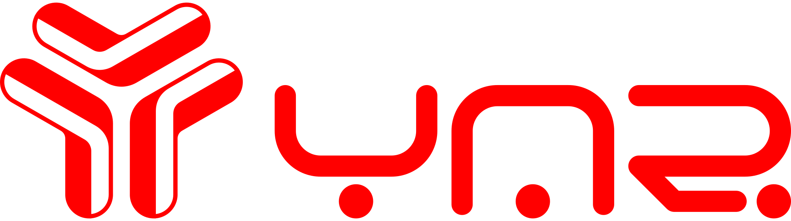

<p align="center"></p>

# Interconnector (YAR Bridge)

See [website](https://yarchain.org/) for more information.


<br>

## Documentation

Monorepository managed by [turborepo](https://turbo.build/repo/docs). 

Contains 2 applications - validator and frontend.
The validator is responsible for performing the functions of the bridge.
Frontend is a ReactJS client.

<br>
<br>

### Before all

Request the .env file and place it in the root of the monorepo

<br>

Install all dependencies

```shell
npm install
```

<br>

Build repository

```shell
npm run build_repo
```

<br>
<br>

### Validator

Build validators

```shell
npm run build_validators
```

To run the validator, run the command

```shell
npm run run_validators
```

This will launch a docker container with the application and all its environment

<br>

To see the status, you can use the docker utilities, or look in the database interface at http://host:8888/db/AppLog/AppStatus

<br>

E2E test:

npm run build_validators
npm run local_node (wait private keys)
npm run run_validator_dev (wait ready status in http://host:8888/db/AppLog/AppStatus)
npm run test_e2e

<br>
<br>

### Frontend

For development tools, you can raise a daemon that will update the ui when the code changes. To do this, you need to run the command

```shell
npm run frontend_dev
```

<br>

To build the application, use the command


```shell
npm run build_frontend
```

This will create a frontend build at /apps/frontend/build
